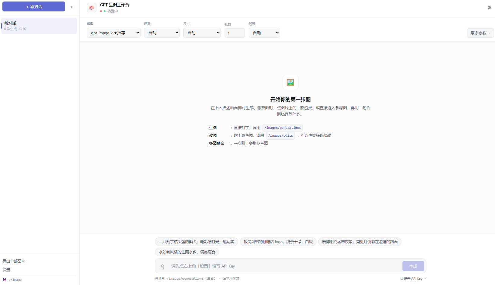

# 🎨 GPT 生图工作台

对话式 AI 生图工具。填个 API 地址和 Key 就能用。



## 快速开始

1. 装 **Node.js 18 或更高版本**（[下载](https://nodejs.org)，建议 20 LTS 以上）
2. 双击 **`启动.bat`** —— 自动构建、启动服务、打开浏览器
3. 点右上角 **⚙**，填 API 地址和 Key
4. 在底部输入框描述画面，回车

> 请用 `启动.bat` 启动，不要直接双击 `dist/index.html`（会因浏览器跨域限制而失败）。
> Key 只存在你本机浏览器里，不会上传，纯本地运行。

## 功能

**生图** —— 打字描述画面，回车出图。

**改图** —— 点图片上的「改这张」，然后用一句话说要改什么，原来的构图和风格会保留，可以连着改多轮。

**多图参考** —— 附多张图做风格迁移或元素融合。

参考图有三种加法：点 📎 选文件、`Ctrl+V` 粘贴、点已生成图片上的「改这张」。

常用参数（模型、画质、尺寸、张数、背景）就摆在顶部；冷门参数收在右边的「更多参数」里。

## 图片存哪

存在项目里的 `image/`，每个对话一个文件夹，文件名带生成时间和提示词：

```
image/20260929213638/
├── 20260929213812489_4f2a_一只戴着宇航头盔的柴犬站在月球表面，背景是深空.png
└── 20260929213912861_9c1b_给这只柴犬戴上一顶红色的毛线帽.png
    └─生成时间(精确到毫秒)─┘ └随机┘ └──── 提示词前 30 字 ────┘
```

对话记录存在 `data/sessions.json`。

想换位置：**设置 ⚙ → 存储 → 图片保存位置**。换的时候会把已经生成的图片**一起搬到新位置**，历史对话照常显示。如果新位置已有同名文件，会跳过不覆盖。

## 出问题先看这里

**报跨域错误** —— 用 `启动.bat` 启动，别直接开 `dist/index.html`。

**提示 `503 No available compatible accounts`** —— API 服务方没容量了，不是你的密钥问题，换个模型。

**出图慢** —— 正常，可能要几十秒到一两分钟。把画质调成 `low`、尺寸用 `1024x1024` 会快些。

**改默认模型** —— 改 `src/types.ts` 里的 `MODEL_PRESETS`，然后 `npm run build`。

## 开发

```bash
npm install
npm run dev     # 热更新开发服务器
npm run build   # 构建到 dist/index.html
```
